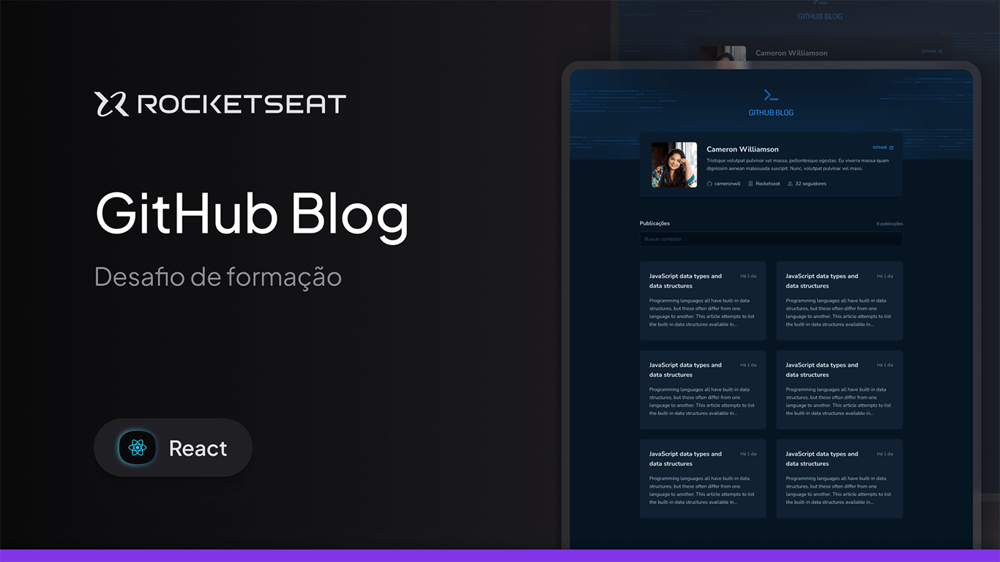

<h1 align="center">
GitHub Blog
</h1>

<p align="center">


</p>

<p align="center">
  
</p>

<p align="center">
  <a href="#-sobre-o-projeto">Sobre</a>&nbsp;&nbsp;&nbsp;|&nbsp;&nbsp;&nbsp;
  <a href="#-funcionalidades">Funcionalidades</a>&nbsp;&nbsp;&nbsp;|&nbsp;&nbsp;&nbsp;
  <a href="#-layout">Layout</a>&nbsp;&nbsp;&nbsp;|&nbsp;&nbsp;&nbsp;
  <a href="#-tecnologias">Tecnologias</a>&nbsp;&nbsp;&nbsp;|&nbsp;&nbsp;&nbsp;
  <a href="#-como-executar">Como Executar</a>&nbsp;&nbsp;&nbsp;|&nbsp;&nbsp;&nbsp;  
  <a href="#-licença">Licença</a>
</p>

## 💻 Sobre o projeto

O **GitHub Blog** é uma aplicação desenvolvida como o terceiro desafio da formação **Ignite 2022 - Trilha ReactJS** da [Rocketseat](https://www.rocketseat.com.br/).

A proposta é criar um blog pessoal que consome a API do GitHub para exibir seu perfil, listar e filtrar as _issues_ de um repositório (que funcionam como posts) e renderizar a página de post completo com o conteúdo em Markdown.

Esta versão foi construída com foco em performance e arquitetura de código limpo, separando o estado dos componentes da camada de serviços (Context API) e otimizando o carregamento da aplicação.

## ✨ Funcionalidades

- **Exibição do Perfil do GitHub:** Mostra dados como avatar, nome, bio, nome de usuário, empresa, número de seguidores e link para o perfil.
- **Listagem de Posts (Issues):** As _issues_ são listadas e paginadas na página inicial.
- **Busca e Paginação com Estado na URL:** A busca e a paginação têm seus estados (query e página) sincronizados com os parâmetros da URL (`?q=...&page=...`), permitindo compartilhamento de links e navegação pelo histórico do navegador.
- **Página de Post Detalhada:** Exibe o conteúdo completo de uma _issue_, com o corpo em Markdown renderizado como HTML.
- **Performance (Code Splitting):** Carregamento _lazy-loading_ (`React.lazy`) da página de post, para que o _build_ principal da aplicação permaneça leve e rápido.
- **Syntax Highlighting:** Blocos de código dentro dos posts são renderizados com formatação e cores (usando `react-syntax-highlighter`).
- **Tratamento de Erros:** Exibe mensagens amigáveis para o usuário, incluindo o tratamento específico do _rate limit_ (erro 403) da API do GitHub.
- **Responsividade:** O layout se adapta a dispositivos móveis e desktops.

## 🎨 Layout

O layout da aplicação foi desenvolvido com base no Figma disponibilizado pela Rocketseat.

<a href="https://www.figma.com/community/file/1138814951106121051" target="_blank">
  
</a>

## 🚀 Tecnologias

Este projeto foi desenvolvido com as seguintes tecnologias e conceitos:

- **React.js** (com **Vite**)
- **TypeScript**
- **Styled Components** (para CSS-in-JS)
- **React Router DOM** (para roteamento, incluindo `useParams` e `useSearchParams`)
- **React.lazy** e **Suspense** (para Code Splitting e Lazy Loading)
- **Axios** (para requisições HTTP)
- **React Hook Form** e **Zod** (para gerenciamento e validação do formulário de busca)
- **React Markdown** e **Remark GFM** (para renderizar o Markdown)
- **React Syntax Highlighter** (para formatar os blocos de código)
- **use-context-selector** (para otimização de performance do Context API, evitando re-renders desnecessários)
- **Date-fns** (para formatação de datas)
- **ESLint** e **Prettier** (para padronização de código)

## ▶️ Como executar

Siga os passos abaixo para rodar o projeto em seu ambiente local:

```bash
# 1. Clone este repositório
$ git clone https://github.com/Robson16/github-blog.git

# 2. Acesse a pasta do projeto
$ cd github-blog

# 3. Instale as dependências
$ npm install
# ou
$ yarn install

# 4. Configure as variáveis de ambiente
# Crie um arquivo .env na raiz do projeto
# e adicione as seguintes variáveis:
VITE_GITHUB_USERNAME=seu-usuario
VITE_GITHUB_REPONAME=seu-repositorio

# 5. Inicie a aplicação
$ npm run dev
# ou
$ yarn dev

# A aplicação estará disponível em http://localhost:5173
```

> **Observação:** Para que a aplicação funcione corretamente, você precisará configurar as variáveis de ambiente com seu nome de usuário e o nome do repositório do GitHub. Crie um arquivo `.env.local` na raiz do projeto e adicione as seguintes variáveis:
>
> ```
> VITE_GITHUB_USERNAME=seu-usuario
> VITE_GITHUB_REPONAME=seu-repositorio
> ```

## 📄 Licença

Este projeto está sob a licença MIT. Veja o arquivo LICENSE para mais detalhes.

---

<p align="center">
  Feito com 💜 por <a href="https://github.com/Robson16/">Robson H. Rodrigues</a>
</p>
